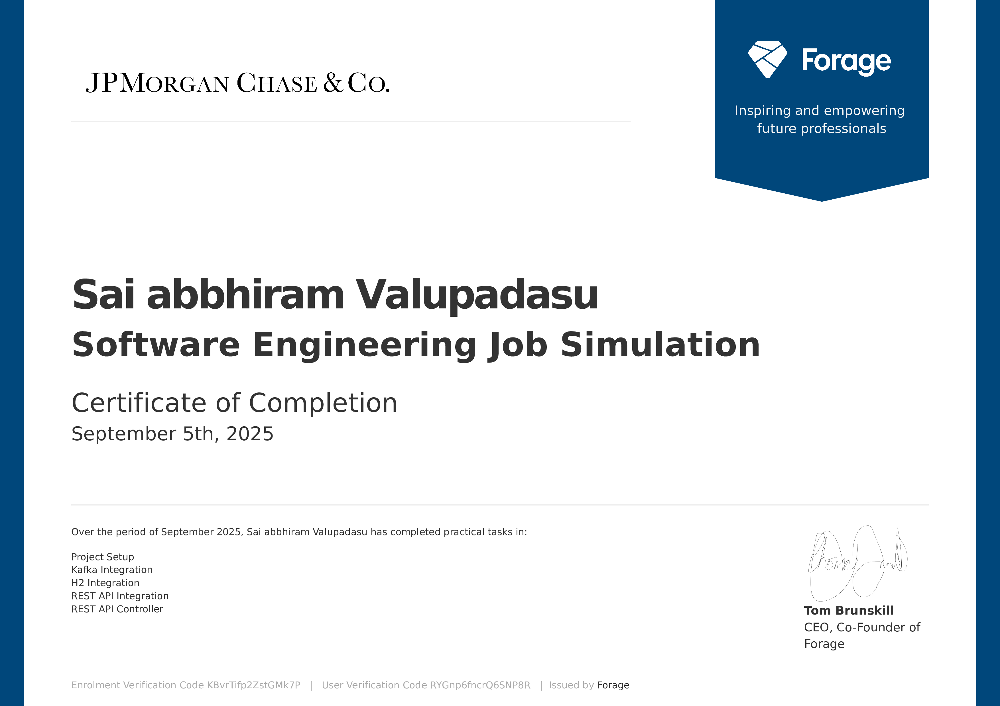

# JPMorgan Chase Software Engineering Virtual Experience (Forage)

This repository contains my implementation of the **Midas Core** system as part of the [Forage JPMorgan Chase Software Engineering Virtual Internship](https://www.theforage.com/).

## Project Overview
The **Midas Core** is responsible for receiving, validating, and recording financial transactions.  
It integrates with:
- **Kafka** for incoming transactions
- **SQL Database (H2 in dev/tests)** for storage & validation
- **REST APIs** for incentivization

The system is built with **Spring Boot** for dependency injection and resource integration.

## Tech Stack
- Java 17
- Spring Boot 3.2.5
- Spring Data JPA
- Spring Web
- Spring Kafka
- H2 Database
- Testcontainers (Kafka)
- Maven (via Maven Wrapper)

## Progress

### ✅ Task One
- Set up local development environment
- Added required dependencies
- Fixed Java version issues (Java 21 → Java 17)
- Configured test properties (`general.kafka-topic`)
- Successfully ran **TaskOneTests**

**Output Snippet:**
> ---begin output ---  
> 1142725631254665682354316777216387420489  
> ---end output ---

---
### ✅ Task Two
- Integrated **Kafka** into Midas Core
- Added `KafkaConfig` to configure Producer, Consumer, and Listener with **JSON serialization**
- Implemented `TransactionListener` to consume messages from Kafka topic configured in `application.yml`
- Verified Kafka listener using embedded Testcontainers Kafka setup
- Successfully ran **TaskTwoTests** and captured the first four incoming transactions

**First 4 Transaction Amounts:**
> 122.86, 42.87, 161.79, 22.22

---


### ✅ Task Three
- Integrated **H2 database** with Spring Data JPA
- Created `TransactionRecord` entity with `@ManyToOne` mapping to `UserRecord`
- Added `TransactionRepository` and `TransactionService` for persistence & validation
- Updated `TransactionListener` to:
  - Validate sender/recipient existence
  - Ensure sufficient balance
  - Persist valid transactions
  - Update balances atomically
- Verified with **TaskThreeTests**

**Final Waldorf Balance (floored):**
> 541

---

### ✅ Task Four
- Integrated the **Incentive API** (local JAR on port 8080).
- Added `IncentiveClient` using `RestTemplate`:
  - POST `/incentive` with `Transaction`.
  - Receive `Incentive { amount }`.
- `TransactionService` now:
  - Persists `TransactionRecord` with `incentive`.
  - Deducts only the **amount** from sender.
  - Adds **amount + incentive** to recipient.

**Result:** Wilbur’s final balance **3592** (rounded down).

---

### ✅ Task Five
- Exposed a **REST API** to query user balances.
- Implemented `BalanceController` with endpoint: GET /balance?userId={id}
- Returns a JSON `Balance` object.
- If user does not exist, returns `Balance {amount=0.0}`.
- Configured application to run on **port 33400**.
- Runs alongside Kafka listeners and Incentive integration.
- Verified with **TaskFiveTests**.

**Output Snippet:**
> ---begin output---  
> Balance {amount=0.0}  
> Balance {amount=1326.98}  
> Balance {amount=2567.52}  
> Balance {amount=2740.33}  
> Balance {amount=140.96999}  
> Balance {amount=10.419973}  
> Balance {amount=845.49005}  
> Balance {amount=657.49}  
> Balance {amount=99.189995}  
> Balance {amount=3434.0002}  
> Balance {amount=2157.1902}  
> Balance {amount=779421.3}  
> Balance {amount=0.0}  
> ---end output ---


## How to Run

1. Ensure **Java 17** and **Docker Desktop** are installed.
2. Clone this repo:
   ```bash
   git clone https://github.com/ValupadasuSaiabbhiram/JPMorgan-Chase-Co-Forage-Midas.git

   cd forage-midas
   ```
3. Run tests
    ```bash
    ./mvnw clean test
    ```
4. Run a specific task test
    ```bash
    #for task one
    ./mvnw -Dtest=TaskOneTests test
    ```
    ```bash
    #for task two
    ./mvnw -Dtest=TaskTwoTests test
    ```
    ```bash
    #for task three
    ./mvnw -Dtest=TaskThreeTests test
    ```
    ```bash
    #for task four (run in two terminals)
    ./mvnw -Dtest=TaskFourTests test

    
    #for Task Five
    ./mvnw -Dtest=TaskFiveTests test

    java -jar services/transaction-incentive-api.jar

## Certificates

- [JPMorgan Advanced Software Engineering Virtual Experience](./certificate/jpmorgan_advanced_software_engineering_job_simulation_completion_certificate.pdf)

 

## Author
**Sai Abbhiram Valupadasu**  
&nbsp;&nbsp;&nbsp;&nbsp;Independent Software Developer | Passionate about backend systems & data engineering  
- [LinkedIn](https://www.linkedin.com/in/sai-abbhiram-valupadasu)  
- [GitHub](https://github.com/SaiAbbhiramValupadasu)
